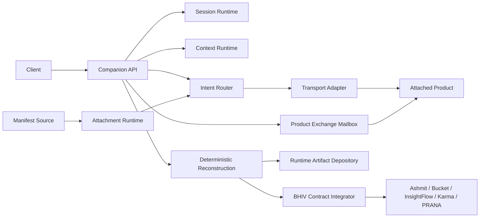

# Companion Runtime Architecture

Mitra is a companion execution layer, not a product intelligence or authority
system. Products connect through manifests and keep their own business logic.

## Components

| Component | Owns | Does not own |
| --- | --- | --- |
| Companion Runtime | API, composition, lifecycle, storage, telemetry | product behavior |
| Session Runtime | session identity and resume tokens | conversation content |
| Context Runtime | scoped context loading and transfer | knowledge retrieval |
| Intent Router | manifest-derived capability and intent lookup | natural-language understanding |
| Attachment Runtime | manifest validation and attachment state | capability implementation |
| Product Exchange Mailbox | explicit envelopes, target inboxes, acknowledgements | automatic private-context merging |
| Transport registry | adapter lookup by manifest mode | product-specific branches |
| Deterministic reconstruction | immutable dispatch reconstruction and hash verification | external replay authority |
| Runtime artifact depository | content-addressed artifacts and subject lineage | ecosystem acceptance or certification |
| BHIV contract integrator | published contract calls and explicit responses | downstream product logic |
| Capability graph | dependency planning over attached manifests | hidden product orchestration |

## Durable State

SQLite stores lifecycle transitions, runtime instances, sessions, scoped
context, attachments, product exchanges, dispatch receipts, dispatch phases,
reconstruction artifacts, depository lineage, companion state, runtime
instances, and transfer receipts.

## Context Boundary

Dispatch loads only the scopes declared by the selected capability. Product
context is keyed by session and active product. Cross-product movement requires
either:

- `/api/v1/sessions/{session_id}/transfer` with explicit `portable_context`;
- `/api/v1/product-exchanges` with an explicit exchange payload.

Source product-private context is never copied automatically.

## Extension Boundary

New products add manifests. New protocols add `TransportAdapter`s. New manifest
registries add `ManifestSourceAdapter`s. Shared runtime modules stay
product-neutral.

## Execution Integrity

Each dispatch persists its request, response, selected route, manifest,
context, phase journal, telemetry references, recovery state, and failure
state. `DeterministicReconstructionLedger` rebuilds execution from those
immutable artifacts and verifies component hashes plus lineage continuity.

BHIV publication occurs only after the dispatch receipt and reconstruction are
recorded. Convergence responses contain bounded depository references, not
nested copies of the entire depository.

## Deployment Topology

Docker and Render use durable `/data` storage and support persistent runtime
supervision. Vercel uses ephemeral `/tmp` storage and disables persistent
supervision. It is a public API host, not the durable recovery topology.
