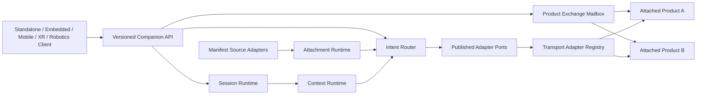
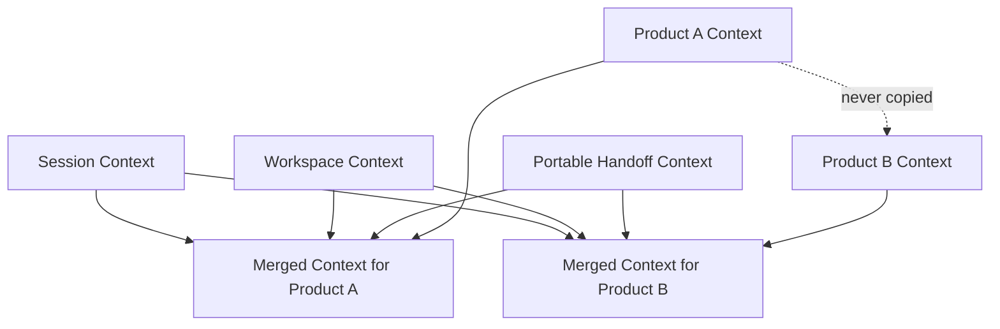
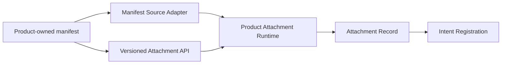

# Companion Runtime Architecture

## Boundary

Mitra Phase V is a universal companion execution layer, not an intelligence
owner. Products attach through manifests and retain their own business logic.
The runtime moves typed requests and bounded context; it does not decide what a
domain action means or whether it is permitted.

## Component responsibilities

| Component | Owns | Does not own |
|---|---|---|
| Companion Runtime | composition, API, durable store, lifecycle, dispatch receipts | product behavior |
| Session Runtime | session identity, resume token validation, client/workspace binding | conversation content |
| Context Runtime | partition loading, revisions, merge order, transfer handoff | knowledge retrieval or inference |
| Intent Router | manifest-derived registration, discovery, capability lookup, explicit product/route selection | natural-language understanding |
| Attachment Runtime | manifest validation, attach/degrade/detach state | capability implementation |
| Product Exchange Mailbox | explicit product-to-product envelopes, target inboxes, acknowledgements | automatic merging of product-private context |
| Adapter ports | manifest discovery and transport interfaces | hidden product implementation |
| Transport registry | adapter lookup by published mode | product-specific routing branches |

## Durable state

SQLite uses WAL mode, full synchronous writes, foreign keys, and explicit
transactions for context revisions. It stores:

- lifecycle transitions;
- sessions and hashed resume tokens;
- session/workspace/product/handoff context partitions;
- product attachment manifests and state;
- product exchange envelopes and acknowledgement state;
- dispatch request/response receipts;
- context transfer receipts.

## Context isolation

The precedence order is session, workspace, handoff, then active product.
Workspace partitions are keyed by actor plus workspace, while product
partitions are keyed by session plus active product. A cross-product transfer
creates a new session and only writes caller-supplied portable context to its
handoff partition. Source product context is excluded.

Dispatch uses the Context Runtime's capability-scoped loading interface. It
loads only the partition identifiers published by the selected capability.

The Intent Router derives registration records from durable attachment
manifests rather than maintaining a second mutable capability source.

## Product attachment runtime

Products can attach themselves through `POST /api/v1/attachments` or through a
manifest-source adapter. A new transport protocol is added by registering a
`TransportAdapter`; a new manifest registry is added by registering a
`ManifestSourceAdapter`. The runtime does not add product-specific branches for
either case.

Products can also use `POST /api/v1/products/connect`, a product-facing alias
for attachment. Once connected, products share explicit information through the
exchange mailbox:

1. Source product creates `POST /api/v1/product-exchanges`.
2. Target product reads `GET /api/v1/products/{product_id}/exchange-inbox`.
3. Target product records receipt, consumption, or rejection with
   `POST /api/v1/product-exchanges/{exchange_id}/ack`.

The exchange mailbox is durable and product-neutral. The runtime stores the
envelope payload and target acknowledgement state; it does not infer authority
or merge private product context unless the source placed that data explicitly
inside the exchange payload.

Attachment records have three states:

- `ATTACHED`: discoverable and routable;
- `DEGRADED`: discoverable but not routable;
- `DETACHED`: hidden from default listings and not routable.

The contract policy is published in
`contracts/product-attachment-runtime-policy.json`.

## Integration contract layer

`contracts/integration-contracts.json` is the stable catalog for product
integrators. It references the OpenAPI surface, JSON Schemas, adapter ports,
and examples. Runtime mutations require explicit version fields so incompatible
clients fail before state changes.

## Source alignment

- Phase IV Runtime Operations informed durable lifecycle, SQLite journaling,
  health, and versioned API patterns.
- Commercial Platform Architecture informed manifest-first attachment,
  capability identity, compatibility, health, and independent ownership.
- SHAKTI, TANTRA, Evidence, and Parikshak repositories were treated as external
  authorities. Their governance, evidence, replay, and readiness logic was not
  copied or reimplemented.

The runtime has no hardcoded product identifiers. Synthetic examples live only
under `contracts/examples` and tests.

The exact implementation ownership allowlist is defined in
`docs/OWNERSHIP_BOUNDARY.md`.
