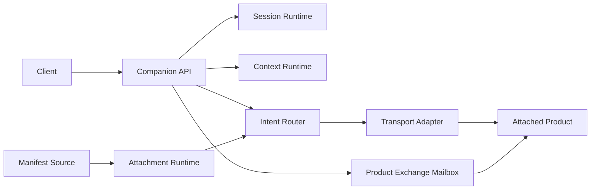

# Companion Runtime Architecture

Mitra is a companion execution layer, not a product intelligence or authority
system. Products connect through manifests and keep their own business logic.

## Components

| Component | Owns | Does not own |
| --- | --- | --- |
| Companion Runtime | API, composition, lifecycle, storage, telemetry | product behavior |
| Session Runtime | session identity and resume tokens | conversation content |
| Context Runtime | scoped context loading and transfer | knowledge retrieval |
| Intent Router | manifest-derived capability and intent lookup | natural-language understanding |
| Attachment Runtime | manifest validation and attachment state | capability implementation |
| Product Exchange Mailbox | explicit envelopes, target inboxes, acknowledgements | automatic private-context merging |
| Transport registry | adapter lookup by manifest mode | product-specific branches |

## Durable State

SQLite stores lifecycle transitions, runtime instances, sessions, scoped
context, attachments, product exchanges, dispatch receipts, dispatch phases,
proof inputs, and transfer receipts.

## Context Boundary

Dispatch loads only the scopes declared by the selected capability. Product
context is keyed by session and active product. Cross-product movement requires
either:

- `/api/v1/sessions/{session_id}/transfer` with explicit `portable_context`;
- `/api/v1/product-exchanges` with an explicit exchange payload.

Source product-private context is never copied automatically.

## Extension Boundary

New products add manifests. New protocols add `TransportAdapter`s. New manifest
registries add `ManifestSourceAdapter`s. Shared runtime modules stay
product-neutral.
