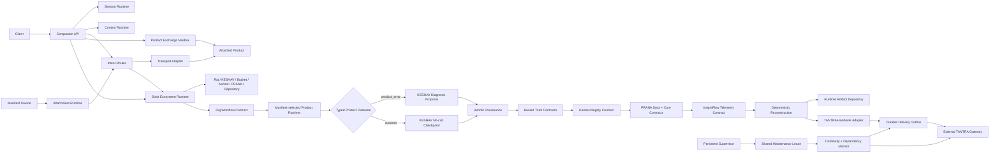

# Companion Runtime Architecture

Mitra is a companion execution layer, not a product intelligence or authority
system. Products connect through manifests and keep their own business logic.

## Components

| Component | Owns | Does not own |
| --- | --- | --- |
| Companion Runtime | API, composition, lifecycle, storage, telemetry | product behavior |
| Session Runtime | session identity and resume tokens | conversation content |
| Context Runtime | scoped context loading and transfer | knowledge retrieval |
| Intent Router | manifest-derived capability and intent lookup | natural-language understanding |
| Attachment Runtime | manifest validation and attachment state | capability implementation |
| Product Exchange Mailbox | explicit envelopes, target inboxes, acknowledgements | automatic private-context merging |
| Transport registry | adapter lookup by manifest mode | product-specific branches |
| Deterministic reconstruction | immutable dispatch and dependency reconstruction plus hash verification | external replay authority |
| Runtime artifact depository | content-addressed artifacts and subject lineage | ecosystem acceptance or certification |
| BHIV contract integrator | published contract calls and explicit responses | downstream product logic |
| Strict ecosystem runtime | Raj-to-Depository ordering, checkpoints, recovery, trace bridge, owner responses | owner logic or embedded acceptance fallback |
| KESHAV boundary | conditional dependency diagnosis transport and response validation | resolution authorization or execution |
| Ecosystem replay ledger | offline full-chain reconstruction, stage/artifact/lineage verification | external replay authority |
| TANTRA handover adapter | deterministic four-bundle projection, durable delivery, gateway health, trace reconciliation, opaque receipts | downstream validation, lineage, convergence, or certification decisions |
| Runtime coordination | lease-fenced maintenance ownership and peer takeover | cross-host consensus without a shared production store |
| Continuity monitor | reconstruction, lineage, dependency, trace, and transport checks | downstream authority judgments |
| Capability graph | dependency planning over attached manifests | hidden product orchestration |

## Durable State

SQLite stores lifecycle transitions, runtime instances, sessions, scoped
context, attachments, product exchanges, dispatch receipts, dispatch phases,
reconstruction artifacts, depository lineage, companion state, runtime
instances, runtime leases, dependency observations, integration deliveries,
continuity snapshots, and transfer receipts.
The ecosystem tables add durable executions, ordered stage checkpoints, every
stage attempt, request/response hashes, replay packages, and owner failures.

## Context Boundary

Dispatch loads only the scopes declared by the selected capability. Product
context is keyed by session and active product. Cross-product movement requires
either:

- `/api/v1/sessions/{session_id}/transfer` with explicit `portable_context`;
- `/api/v1/product-exchanges` with an explicit exchange payload.

Source product-private context is never copied automatically.

## Extension Boundary

New products add manifests. New protocols add `TransportAdapter`s. New manifest
registries add `ManifestSourceAdapter`s. Shared runtime modules stay
product-neutral.

## Execution Integrity

`POST /api/v1/ecosystem/execute` is the final assignment acceptance path. It
selects a capability from attached manifests, sends that contract to Raj, and
accepts only a trace-preserving product success or typed product error. Success
records a KESHAV no-call checkpoint. A typed product error invokes KESHAV and
requires a valid diagnosis proposal before the chain continues through Ashmit,
Bucket, Karma, PRANA, InsightFlow, replay, and Central Depository. Mitra does
not apply the proposal. The runtime is fail-closed and has no embedded
fallback. Each accepted stage is content-addressed and linked into one subject
lineage chain before the execution is sealed.

The older direct dispatch path remains a compatibility surface for attached
products. Its receipts and reconstruction are not presented as proof that the
final cross-owner ecosystem chain ran.

Each dispatch persists its request, response, selected route, manifest,
context, dependency catalog, phase journal, telemetry references, recovery
state, and failure state. `DeterministicReconstructionLedger` rebuilds
execution from those immutable artifacts and verifies component hashes plus
lineage continuity.

BHIV publication occurs only after the dispatch receipt and reconstruction are
recorded. Convergence responses contain bounded depository references, not
nested copies of the entire depository.

The TANTRA package is built from that same verified reconstruction before the
BHIV convergence packet is hashed. The package and delivery result are stored
in `packet.handoffs`, so the returned convergence object still matches its
content-addressed artifact. Only the TANTRA gateway is called; downstream
authority coordination remains outside Mitra.

The request is stored in `integration_outbox` before network I/O. A delivery
lease prevents duplicate workers, expires after process loss, and allows a peer
to continue the same request bytes. The maintenance lease ensures one live
instance performs shared recovery, health checks, delivery retries, and
continuity scans at a time.

## Deployment Topology

Docker and the persistent Render profile can use SQLite on durable `/data`.
The public Vercel profile uses managed PostgreSQL for runtime state; `/tmp`
contains only non-authoritative process-local files. Both backends preserve the
same store, lease, outbox, checkpoint, and replay interfaces.

SQLite coordination supports multiple processes sharing one durable host.
PostgreSQL adds cross-instance transactions and a transaction-scoped advisory
lock for the sections that use SQLite `BEGIN IMMEDIATE`. This allows stateless
instances to share runtime state without changing orchestration contracts.
Vercel may still suspend background compute between requests, so continuously
scheduled maintenance requires a resident container runtime.
