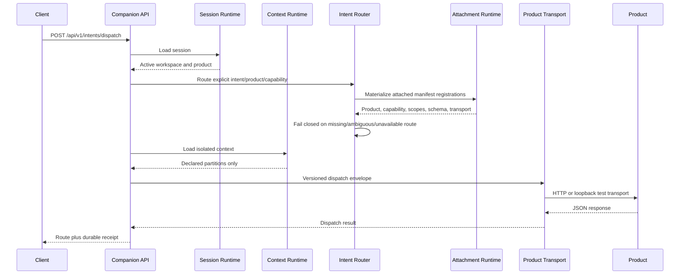
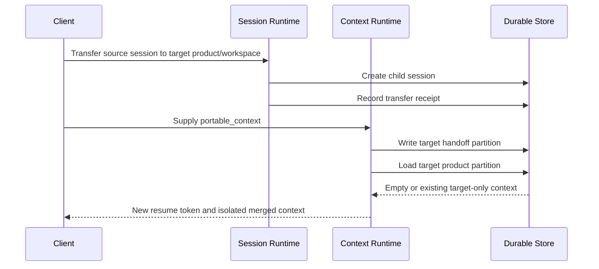

# Execution Flow

## Intent dispatch

The router never infers an intent from free text. The caller or a separately
owned conversation/intelligence component supplies the registered `intent_id`.

## Context transfer

## Failure behavior

- unknown or ambiguous intent: fail closed before transport;
- unknown capability: fail with `404` before transport;
- cross-product dispatch without transfer: conflict;
- stale context revision: conflict with current revision preserved;
- incompatible attachment contract: reject before registration;
- HTTP timeout/non-2xx/non-JSON: dispatch fails, product becomes degraded, and
  the lifecycle enters `DEGRADED`;
- unexpected adapter exception: normalize to transport failure and persist a
  failed dispatch receipt;
- runtime shutdown: stop accepting work, record `DRAINING`, then `STOPPED`.
