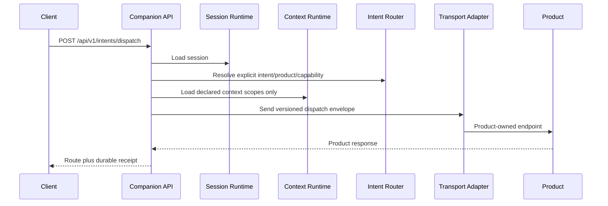
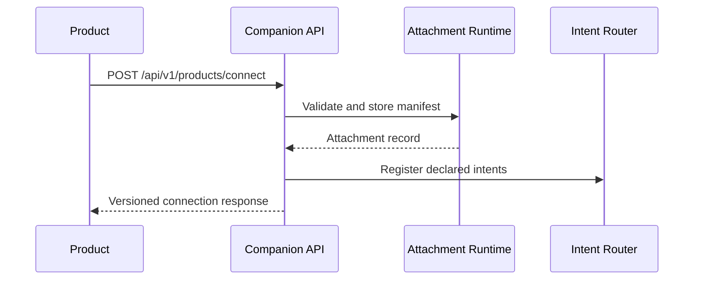
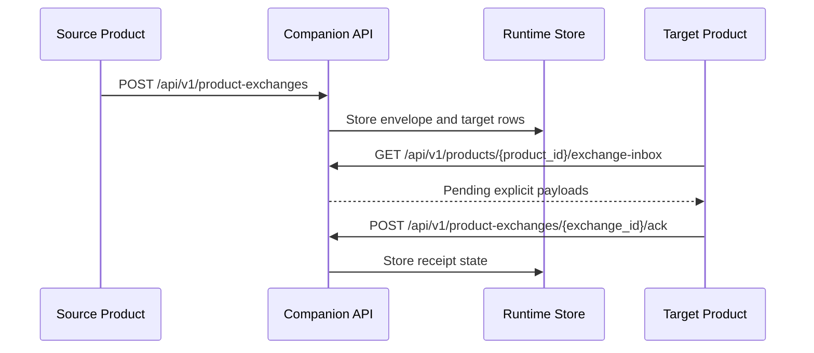

# Execution Flow

## Dispatch

## Product Connect

## Product Exchange

## Transfer

`/api/v1/sessions/{session_id}/transfer` creates a target session and writes
only caller-supplied `portable_context` to the target handoff partition.

## Failure Rules

- unknown or ambiguous intent: fail before transport;
- cross-product dispatch without transfer: conflict;
- stale context revision: conflict;
- invalid manifest: reject before registration;
- transport failure: persist failed dispatch and degrade only that attachment;
- shutdown: stop accepting work, drain, then stop.
