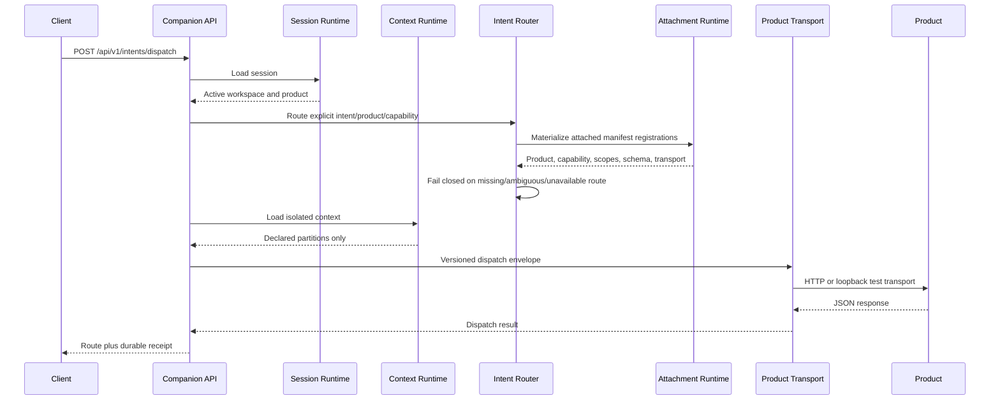
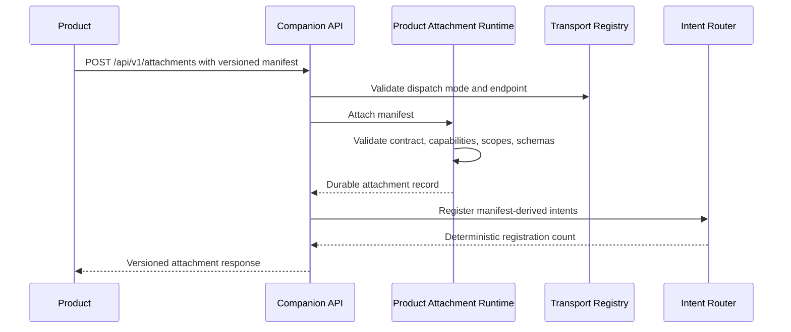
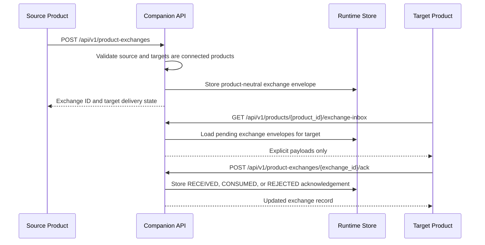
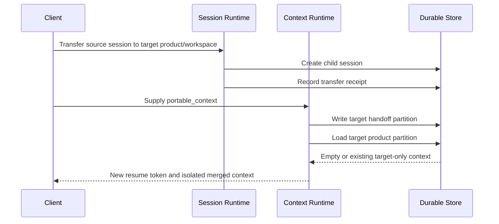

# Execution Flow

## Intent dispatch

The router never infers an intent from free text. The caller or a separately
owned conversation/intelligence component supplies the registered `intent_id`.

## Product self-attachment

No product-specific code path is added to the Companion Runtime. New manifest
registries and new transports are plugged in through adapter ports.

## Product exchange mailbox

This is the product-to-product information-sharing surface. It is not hidden
shared memory and it does not copy private product context. Only the explicit
exchange payload is shared.

## Context transfer

## Failure behavior

- unknown or ambiguous intent: fail closed before transport;
- unknown capability: fail with `404` before transport;
- cross-product dispatch without transfer: conflict;
- stale context revision: conflict with current revision preserved;
- incompatible attachment contract: reject before registration;
- duplicate attachment capability/scope/intent declarations: reject before
  registration;
- HTTP timeout/non-2xx/non-JSON: dispatch fails, product becomes degraded, and
  the lifecycle enters `DEGRADED`;
- unexpected adapter exception: normalize to transport failure and persist a
  failed dispatch receipt;
- runtime shutdown: stop accepting work, record `DRAINING`, then `STOPPED`.
