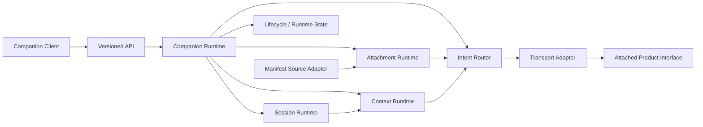
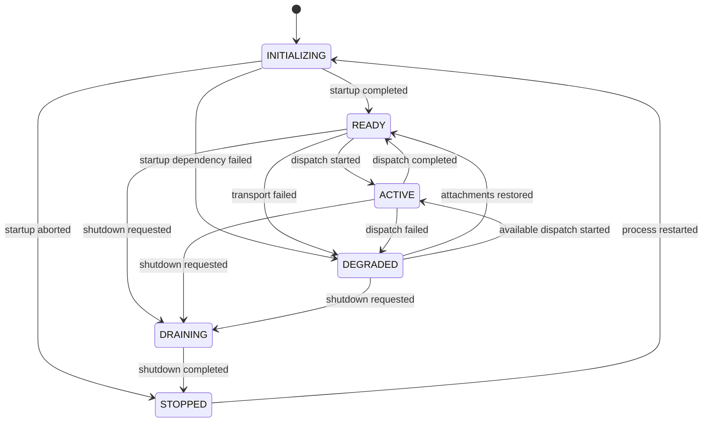

# Phase 1 - Companion Runtime Design

## Phase 1 outcome

Phase 1 establishes the architecture and contracts for Pratham's bounded
runtime ownership. It defines:

1. Companion Runtime architecture;
2. runtime lifecycle;
3. runtime and component states;
4. public runtime interfaces.

The implementation is contract-first and adapter-driven. It contains no
conversation design, governance, safety, knowledge, project/domain
intelligence, evidence, replay, or certification behavior.

## Architecture

### Architectural rules

- `CompanionRuntime` is the composition root.
- Component runtimes depend on narrow protocols, not concrete siblings.
- Products are known only through published attachment manifests.
- Intent routing uses explicit registered IDs; no language or domain inference
  occurs.
- Context is partitioned into session, workspace, handoff, and active-product
  scopes.
- Cross-product work requires a new target session and explicit portable
  handoff context.
- Transport and manifest discovery are adapters selected at composition time.
- Durable state is a replaceable port; SQLite is the default implementation.

## Lifecycle

Lifecycle invariants:

- every transition is validated against `ALLOWED_TRANSITIONS`;
- every accepted transition is durably journaled;
- invalid transitions fail closed;
- `DRAINING` accepts only completion to `STOPPED`;
- `STOPPED` can re-enter only through `INITIALIZING`.

## States

### Runtime

| State | Meaning |
|---|---|
| `INITIALIZING` | persistence and published interfaces are being prepared |
| `READY` | new sessions, attachments, transfers, and dispatches are accepted |
| `ACTIVE` | a dispatch is executing |
| `DEGRADED` | an attachment transport has failed; unaffected interfaces remain observable |
| `DRAINING` | shutdown has begun and new work is blocked |
| `STOPPED` | runtime execution is stopped |

### Session

| State | Meaning |
|---|---|
| `ACTIVE` | context mutation, transfer, and intent dispatch are permitted |
| `SUSPENDED` | durable and resumable; mutation, transfer, and dispatch are blocked |
| `CLOSED` | terminal; resume and execution are blocked |

### Attachment

| State | Meaning |
|---|---|
| `ATTACHED` | manifest and adapter target are valid |
| `DEGRADED` | manifest remains registered but transport failed |
| `DETACHED` | terminal routing state; no new intent route may use it |

### Dispatch

| State | Meaning |
|---|---|
| `ACCEPTED` | dispatch envelope is durably recorded |
| `COMPLETED` | adapter returned a valid result |
| `FAILED` | adapter failed and the failure was durably recorded |

The normative machine-readable definition is
`contracts/runtime-state-machine.json`.

## Runtime interfaces

| Interface | Protocol | Main operations |
|---|---|---|
| Companion Runtime | `CompanionRuntimeInterface` | start, stop, status, attach, dispatch, transfer context |
| Lifecycle | `LifecycleInterface` | transition, history |
| Session Runtime | `SessionRuntimeInterface` | create, get, resume, suspend, close, transfer |
| Context Runtime | `ContextRuntimeInterface` | load, update, initialize transfer |
| Intent Router | `IntentRouterInterface` | discover, route |
| Attachment Runtime | `AttachmentRuntimeInterface` | attach, get, list, degrade, detach |
| Context Transfer Runtime | `ContextTransferRuntimeInterface` | transfer context |

Python protocols are published in
`mitra_companion.interfaces`. Adapter and persistence ports are published in
`mitra_companion.ports`. The normative operation catalog is
`contracts/runtime-interface-catalog.json`.

## Phase 1 acceptance criteria

- architecture diagram and component responsibilities are documented;
- lifecycle states and legal transitions are exact and machine-readable;
- all declared component states have defined triggers;
- public runtime protocols are runtime-checkable;
- concrete implementations conform to their protocols;
- API operations map to owned runtime interfaces only;
- interface and state catalogs validate against JSON Schema;
- no forbidden subsystem implementation is introduced.

