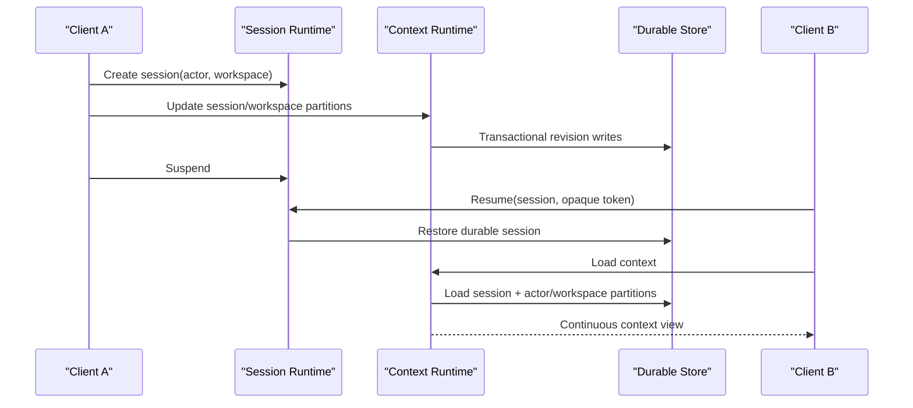

# Phase 2 - Context Runtime

## Scope

Phase 2 implements the bounded Context Runtime capability:

- context loading;
- context updates;
- session continuity;
- workspace continuity;
- product context isolation.

It stores and moves opaque JSON context. It does not interpret context as
knowledge, apply governance or safety policy, perform domain reasoning, produce
evidence, or own replay/certification.

## Partition model

| Partition | Durable identity | Continuity | Isolation |
|---|---|---|---|
| `session` | `session_id` | resume, suspend/resume, and runtime restart | one session |
| `workspace` | `actor_id` + `workspace_id` | sessions and client types for the same actor/workspace | one actor/workspace namespace |
| `handoff` | target `session_id` | target session | explicit portable transfer data only |
| `product` | `session_id` + `active_product_id` | active product within a session | one session/product pair |

`actor_id` is an opaque isolation key supplied through the published session
interface. Authentication and authorization of that identity remain outside
this runtime.

## Context loading

`ContextRuntime.load(session_id, scopes=None)` loads all partitions by default.
Callers may request a subset of the four published scope identifiers.
Unknown scopes are rejected.

`ContextRuntime.load_for_capability(session_id, scopes)` is the least-privilege
adapter used by dispatch. It receives only the scopes declared by the attached
capability manifest, so the dispatch path never needs to load unrelated
partitions.

The fixed merge precedence is:

```text
session -> workspace -> handoff -> product
```

Later partitions override duplicate keys from earlier partitions. The response
also exposes the loaded scope list, merge precedence, continuity metadata,
individual partition revisions, and the merged JSON view.

## Context updates

Updates are accepted only while the session is `ACTIVE`.

- `expected_revision` provides optimistic concurrency control.
- `replace=false` performs a shallow key merge.
- `replace=true` replaces the complete selected partition.
- each successful write increments that partition's revision;
- stale revisions fail without mutating the current value.

The update interface derives every partition key from the session record.
Callers cannot submit an arbitrary actor, workspace, or product isolation key.

## Continuity



Session context survives process recreation because both the session identity
and context partitions are durable. Workspace context is available to a new
session or client type only when both `actor_id` and `workspace_id` match.

## Product isolation and transfer

Product context is looked up only from the session's `active_product_id`.
There is no public operation that accepts a different product key for loading
or updating product context.

Cross-product work creates a target session. Source product context is never
copied. Only caller-supplied `portable_context` is written to the target
session's `handoff` partition, and the target's own product partition starts
empty unless it already owns data in that target session.

## Persistence migration

Phase 1 keyed workspace data only by `workspace_id`. Phase 2 migrates a legacy
workspace row only when the existing database proves that exactly one actor
used that workspace. Ambiguous legacy rows are not exposed to any actor,
preventing cross-actor context disclosure.

## Published contracts

- `contracts/context-runtime-policy.json`
- `contracts/schemas/context-runtime-policy.schema.json`
- `contracts/schemas/context-view.schema.json`
- `contracts/schemas/context-update.schema.json`
- `contracts/schemas/context-transfer.schema.json`
- `contracts/api/companion-runtime.openapi.yaml`
- `contracts/runtime-interface-catalog.json`

## Acceptance criteria

| Requirement | Implementation proof |
|---|---|
| Context loading | full and selective partition loads with deterministic merge order |
| Context updates | merge/replace writes with optimistic revisions |
| Session continuity | durable context across suspend/resume and runtime recreation |
| Workspace continuity | actor/workspace partition shared across sessions and client types |
| Product context isolation | session/product keying, active-product-only access, no transfer copying |

