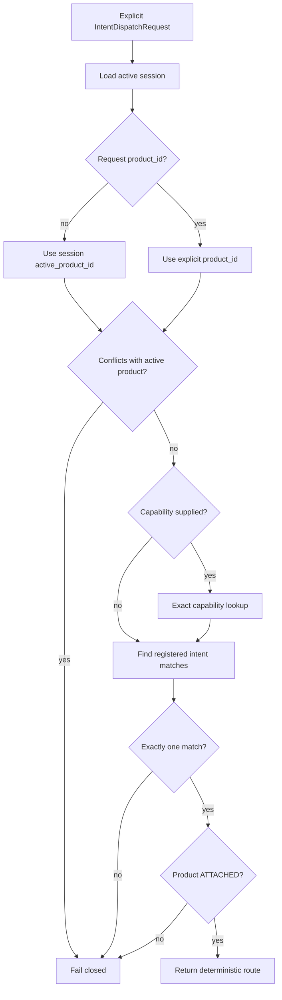

# Phase 3 - Intent Router

## Scope

Phase 3 implements intent registration, discovery, dispatch, capability lookup,
and product routing.

The router accepts explicit registered identifiers only. It does not perform
natural-language understanding, infer user intent, interpret domain meaning,
or make governance and safety decisions.

## Registration model

An attached product manifest is the single durable source of registration.
The router materializes one deterministic registration for each:

```text
product_id + capability_id + intent_id
```

The registration contains product/version identity, attachment state,
capability context scopes, input JSON Schema, transport target, and opaque
metadata. No product code or hidden architecture is imported.

`IntentRouter.register(product_id)` exposes the materialized registration set.
It remains available after restart because the source manifest is durable.

Intent IDs must be unique inside one capability. The same explicit intent ID
may appear in multiple capabilities; the caller must then provide
`capability_id`.

## Discovery and capability lookup

Intent discovery supports `product_id`, `capability_id`, `intent_id`, and
`available_only` filters. Results are ordered by product, capability, and
intent ID. Detached products are excluded. Degraded products remain visible
for inspection unless `available_only=true`, but cannot receive dispatches.

Capability operations are separate:

- `capabilities(...)` returns ordered capability summaries;
- `lookup_capability(product_id, capability_id)` returns one exact capability
  or fails with `404`.

## Product and capability routing



Product selection precedence is the explicit request product followed by the
session's active product. A session already bound to a product cannot dispatch
to another product; an explicit context transfer is required. An unbound
session may explicitly select an attached product.

## Dispatch pipeline

1. Validate payload against the registered JSON Schema 2020-12 document.
2. Load only context scopes declared by the selected capability.
3. Persist an `ACCEPTED` dispatch receipt.
4. Select the transport adapter by registered mode.
5. Persist `COMPLETED` with the response or `FAILED` with an error.
6. Degrade the product/runtime when transport fails.

Unexpected adapter exceptions are normalized into `TransportError` and
persisted instead of bypassing failure handling.

## Published APIs and contracts

- `GET /api/v1/products/{product_id}/intent-registrations`
- `GET /api/v1/intents`
- `GET /api/v1/capabilities`
- `GET /api/v1/products/{product_id}/capabilities/{capability_id}`
- `POST /api/v1/intents/dispatch`
- `contracts/intent-router-policy.json`
- `contracts/schemas/intent-router-policy.schema.json`
- `contracts/schemas/intent-registration.schema.json`
- `contracts/schemas/capability-view.schema.json`

## Acceptance criteria

| Requirement | Implementation proof |
|---|---|
| Intent registration | manifest-derived deterministic registration records |
| Intent discovery | exact filters, stable ordering, availability filtering |
| Intent dispatch | schema validation, scoped context, adapter invocation, durable receipt |
| Capability lookup | capability list and exact lookup interfaces |
| Product routing | request/session resolution, cross-product blocking, availability checks |

