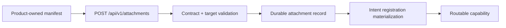

# Phase 4 - Product Attachment Runtime

Phase 4 implements product attachment as a bounded runtime capability. Products
attach by publishing manifests that satisfy the public contract. The Companion
Runtime does not import product implementation code and does not add
product-specific routing branches.

## Goals satisfied

| Requirement | Implementation |
|---|---|
| Implement Product Attachment Runtime | `pratham/attachment-runtime/mitra_attachment/runtime.py` |
| Products attach themselves | `POST /api/v1/attachments` accepts a versioned manifest request |
| No Companion Runtime modification per product | manifests and adapter ports carry all product-facing metadata |
| Interface driven | `AttachmentRuntimeInterface`, `ManifestSourceAdapter`, `TransportAdapter`, and store ports |
| Attachment lifecycle | `ATTACHED`, `DEGRADED`, and `DETACHED` state policy |

## Attachment model

The runtime validates:

- attachment contract version;
- product and capability identity;
- duplicate capability IDs;
- duplicate context scopes inside a capability;
- duplicate intent IDs inside a capability;
- each intent input JSON Schema;
- declared transport mode and endpoint through the selected adapter.

## Self-attachment paths

Products can attach through either published path:

1. `POST /api/v1/attachments` with a versioned request body.
2. A `ManifestSourceAdapter` supplied to the composition root.

The bundled directory source loads arbitrary manifest filenames from a
configured directory. New source types implement the same adapter and do not
modify the Companion Runtime.

## State policy

| State | Discoverable | Routable | Meaning |
|---|---:|---:|---|
| `ATTACHED` | yes | yes | manifest is valid and transport is usable |
| `DEGRADED` | yes | no | manifest remains visible, dispatch is blocked |
| `DETACHED` | no by default | no | retained for audit when explicitly requested |

`GET /api/v1/attachments?include_detached=true` exposes detached records for
audit and troubleshooting. The default list only returns active or degraded
products.

## Extension rule

A new product supplies a manifest. A new protocol supplies a `TransportAdapter`.
A new manifest registry supplies a `ManifestSourceAdapter`.

None of those cases require product-specific edits to:

- `CompanionRuntime`;
- `IntentRouter`;
- `ContextRuntime`;
- `SessionRuntime`;
- `AttachmentRuntime`.

