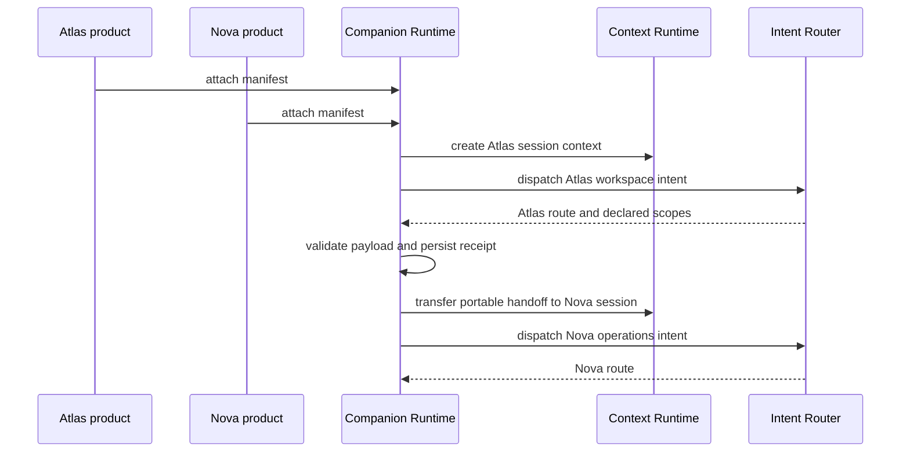

# Phase 6 - Testing

Phase 6 expands verification beyond unit behavior into runtime simulation,
multi-product attachment, context transfer, routing, attachment validation, and
failure handling.

## Test coverage map

| Requirement | Test files |
|---|---|
| Runtime simulation | `pratham/tests/test_phase6_runtime_simulation.py` |
| Multiple products attached | `test_phase6_runtime_simulation_multiple_products_and_transfer` |
| Context transfer validation | Phase 2 context tests plus Phase 6 transfer simulation |
| Intent routing validation | Phase 3 router tests plus Phase 6 dispatch simulation |
| Attachment validation | Phase 4 and Phase 6 attachment validation tests |
| Failure handling | `test_dispatch_and_failures.py` and Phase 6 degraded-product simulation |
| Integration contracts | `test_phase5_integration_contracts.py` |

## Simulation scenario

The test verifies that source product context does not cross into the target
product. Only caller-supplied portable context is written into the handoff
partition.

## Failure scenario

A custom test adapter intentionally raises `TransportError`. The runtime:

1. persists the accepted dispatch receipt;
2. records the dispatch as `FAILED`;
3. marks only the failing product `DEGRADED`;
4. transitions lifecycle to `DEGRADED`;
5. continues to route healthy products.

This proves failure containment without governance, external evidence
authority, external replay authority, or certification coupling.

