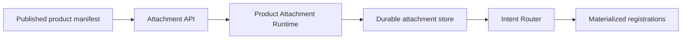
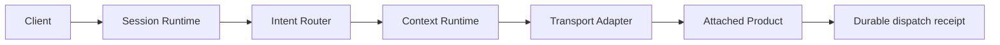
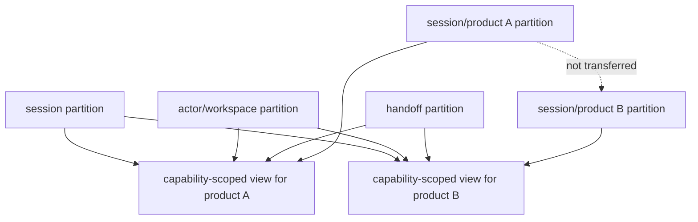
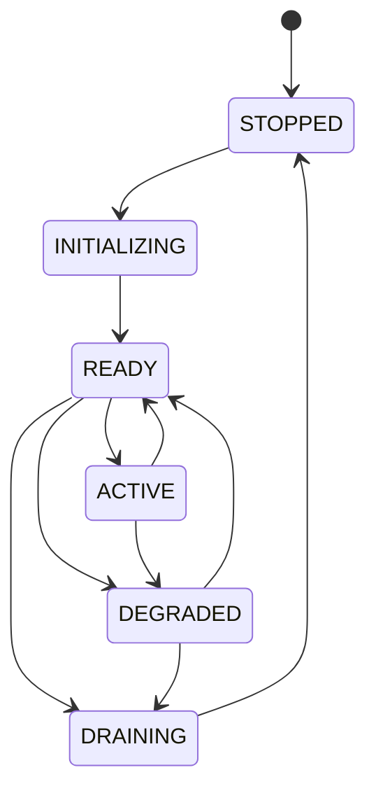

# Runtime Diagrams

This page collects the main runtime diagrams in one place for review.

## Capability attachment

## Dispatch path

## Context partitions

## Lifecycle and failure containment

Transport failures degrade the affected attachment and runtime state. Healthy
attachments remain attached and can still be routed when explicitly selected.

