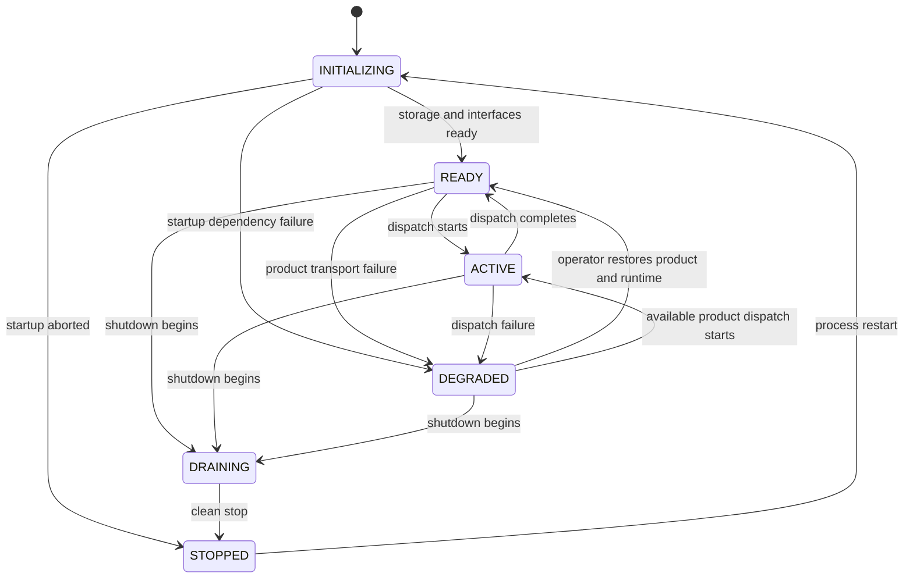

# Runtime Lifecycle



Every transition is appended to `runtime_transitions` with source state, target
state, reason, sequence, and UTC timestamp. Illegal transitions raise an error.
`DRAINING` may transition only to `STOPPED`.

Attachment lifecycle is independent:

```text
ATTACHED -> DEGRADED -> ATTACHED
ATTACHED -> DETACHED
DEGRADED -> DETACHED
```

A degraded product does not erase its manifest, sessions, context, or dispatch
history.

Session lifecycle:

```text
ACTIVE -> SUSPENDED -> ACTIVE
ACTIVE -> CLOSED
SUSPENDED -> CLOSED
```

Suspended sessions remain durable and resumable but cannot mutate context,
transfer, or dispatch. Closed sessions are terminal.

The normative state catalog is `contracts/runtime-state-machine.json`.
