# Architecture Packet

## Boundary

Mitra owns runtime interaction and execution orchestration. Product-owned
intelligence stays behind published manifests and transports.

## Components

- `CompanionRuntime`: composition root and lifecycle boundary.
- `SessionRuntime`: durable user/workspace/session identity.
- `ContextRuntime`: scoped context loading and memory preservation.
- `IntentRouter`: deterministic registry and exact route lookup.
- `AttachmentRuntime`: product manifest lifecycle and health state.
- `NaturalIntentResolver`: generic message-to-capability selection.
- `CapabilityTransport`: adapter registry for product-owned execution.
- `RuntimeTelemetry`: JSONL events, metrics, and Prometheus text.

## Flow

```mermaid
flowchart LR
  User["User message"] --> API["Companion message API"]
  API --> Session["Session runtime"]
  Session --> Memory["Companion memory"]
  Memory --> Resolver["Natural intent resolver"]
  Resolver --> Registry["Intent/capability registry"]
  Registry --> Payload["Schema payload builder"]
  Payload --> Dispatch["Runtime dispatch"]
  Dispatch --> Transport["Manifest-selected transport"]
  Transport --> Product["Attached BHIV product"]
  Product --> Receipt["Dispatch receipt"]
  Receipt --> Memory
  Receipt --> API
```

## Product Integration Rule

New products attach only through:

- manifest;
- adapter/transport contract;
- published capability and intent schemas;
- validation and evidence.

No runtime code path contains UniGuru or Samruddhi branches.

## Runtime Intelligence

Ranking uses published descriptions, product/capability IDs, schema fields,
session affinity, memory, availability, and observed latency. If deterministic
selection cannot confidently choose and `MITRA_COMPANION_AI_RESOLVER_URL` is
configured, the runtime can ask a vendor-neutral AI resolver to choose from the
same sanitized candidate list.
