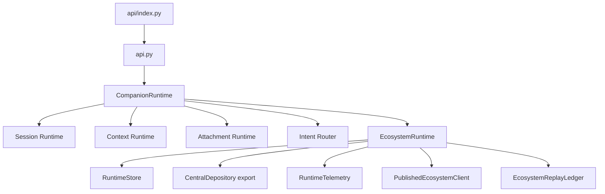

# Dependency Graphs

## Runtime Dependency Graph

## Integration Dependency Graph

```mermaid
flowchart LR
  User["User request"] --> Mitra["Mitra capability selection"]
  Mitra --> Preflight["Raj / KESHAV / Bucket / Ashmit / PRANA / Depository preflight"]
  Preflight --> Raj["Raj workflow execution"]
  Raj --> Product["Manifest-selected product"]
  Product --> Outcome{"Typed outcome"}
  Outcome -->|product_error| Keshav["KESHAV diagnosis"]
  Outcome -->|success| Skip["KESHAV no-call checkpoint"]
  Keshav --> Ashmit["Ashmit provenance"]
  Skip --> Ashmit
  Ashmit --> Bucket["Bucket truth persistence"]
  Bucket --> Karma["Karma integrity acceptance"]
  Karma -->|"status=appended"| Prana["PRANA strict + core"]
  Prana --> Insight["InsightFlow telemetry"]
  Insight --> Replay["Offline deterministic reconstruction"]
  Replay --> Export["Central Depository package"]
  Karma -->|"rejected"| Stop["Stop downstream calls"]
```

## Ownership Edge

Mitra owns every rectangular orchestration edge and recorded runtime fact. The
named owner nodes own their response semantics. No owner implementation is
imported into Mitra.
